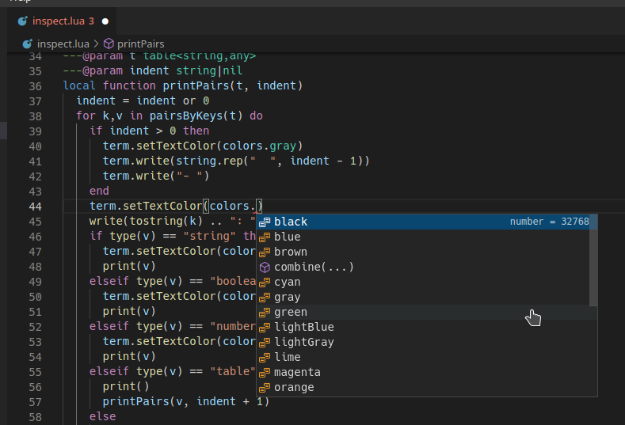
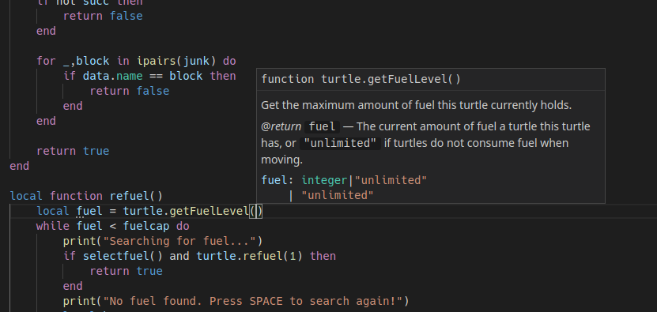
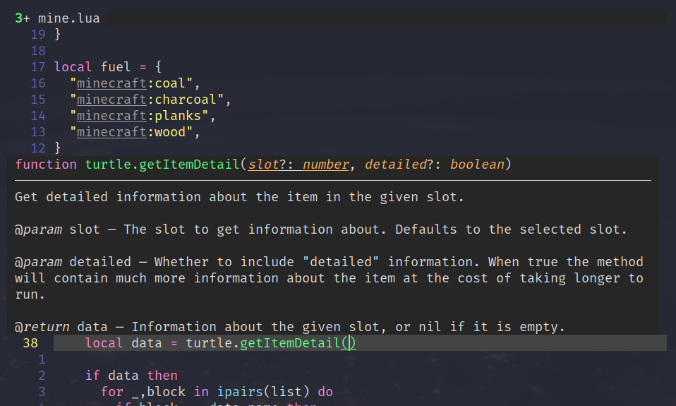
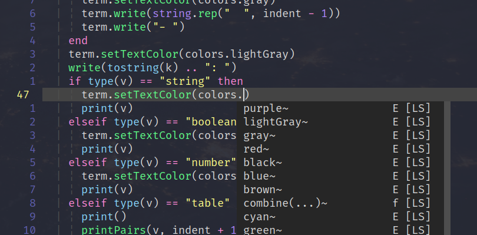

# CC-Tweaked EmmyLua Annotations

Based on CC-Tweaked v1.100.4 for Minecraft 1.18.2.
Manually scraped from the docs: <https://tweaked.cc/>.

## What this repo does

When installed correctly, this will add intellisense/autocompletions and basic
documentation right into your editor by showing:

- Help text
- Parameter types
- API method names

It does this by declaring EmmyLua annotations (docs: <https://github.com/sumneko/lua-language-server/wiki/EmmyLua-Annotations>)
that the lua-language-server made by Sumneko reads to provide intellisense.
Sumneko's language server is available in:

- VS Code: <https://marketplace.visualstudio.com/items?itemName=sumneko.lua>
- VS Codium: <https://open-vsx.org/extension/sumneko/lua>
- (Neo)vim: <https://github.com/xiyaowong/coc-sumneko-lua> (via [coc.nvim](https://github.com/neoclide/coc.nvim))

## Preview

### VS Code




### (Neo)vim




## Install Lua-language-server

Just install the VS Code/coc.nvim extension and everything should work fine:

- VS Code: <https://marketplace.visualstudio.com/items?itemName=sumneko.lua>

- VS Codium: <https://open-vsx.org/extension/sumneko/lua>

- coc.nvim: `:CocInstall coc-sumneko-lua`

## Install files

Clone this repo to somewhere nice, such as your documents folder:

```sh
cd ~/Documents
git clone https://github.com/jilleJr/CC-Tweaked-EmmyLua.git
```

Get the full path of the cloned repository on your disk, as we will use it
in the config in the section below:

## Configure language server

Open your editors config file. For coc.nvim, you would run:

```vim
:CocConfig
```

Add the following fields, but ensure the `Lua.workspace.library` is the
correct path to the cloned CC-Tweaked-EmmyLua repo:

```json
{
    "Lua.workspace.library": [
        "/home/yourname/Documents/CC-Tweaked-EmmyLua"
    ],
    "Lua.workspace.maxPreload": 2000,
    "Lua.workspace.preloadFileSize": 1000,
    "Lua.runtime.version": "Lua 5.1",
    "Lua.runtime.builtin": {
        "os": "disable",
        "io": "disable"
    },
    "Lua.diagnostics.enable": true,
    "Lua.diagnostics.globals": [],
    "Lua.diagnostics.disable": [
        "lowercase-global"
    ],
    "Lua.completion.keywordSnippet": "Disable",
    "Lua.telemetry.enable": false
}
```

## Existing documentation

- [x] Globals:

  - [x] \_G
  - [x] colors
  - [x] colours
  - [x] commands
  - [x] disk
  - [x] fs
  - [x] gps
  - [x] help
  - [x] http
  - [x] io
  - [x] keys
  - [x] multishell
  - [x] os
  - [x] paintutils
  - [x] parallel
  - [x] peripheral
  - [x] pocket
  - [x] rednet
  - [x] redstone
  - [x] settings
  - [x] shell
  - [x] term
  - [x] textutils
  - [x] turtle
  - [x] vector
  - [x] window

- [x] Modules:

  - [x] cc.audio.dfpwm
  - [x] cc.completion
  - [x] cc.expect
  - [x] cc.image.nft
  - [x] cc.pretty
  - [x] cc.require
  - [x] cc.shell.completion
  - [x] cc.strings

- [x] Peripherals:

  - [x] command
  - [x] computer
  - [x] drive
  - [x] modem
  - [x] monitor
  - [x] printer
  - [x] speaker

- [x] Generic peripherals:

  - [x] energy\_storage
  - [x] fluid\_storage
  - [x] inventory

## Install on NixOS

In case you get the following symptom:

```console
$ ls
lua-language-server
main.lua

$ ./lua-language-server
bash: no such file or directory: ./lua-language-server
```

It might be something wrong with the VS Code provided binary together with how
NixOS stores its library files.

Can be resolved by installing it from nixpkgs instead:

```sh
nix-env -i sumneko-lua-language-server
```

Then override the one in the extension with the NixOS variant:

```sh
# For VS Code:
cp $(which lua-language-server) ~/.vscode/extensions/sumneko.lua-*/server/bin/Linux/lua-language-server

# For VS Codium:
cp $(which lua-language-server) ~/.vscode-oss/extensions/sumneko.lua-*/server/bin/Linux/lua-language-server

# For coc.nvim:
# 1. First open a .lua file and tell it to download the language server
# 2. Run the following command:
cp $(which lua-language-server) ~/.config/coc/extensions/coc-sumneko-lua-data/sumneko-lua-ls/extension/server/bin/lua-language-server
```

And then restart your editor.
