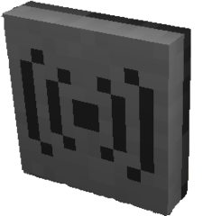

# Peripherals

The LUA language server cannot automatically determine the peripheral type
for you, so you have to annotate your code with the types, which is done by
the [`---@type` EmmyLua annotation](https://github.com/sumneko/lua-language-server/wiki/EmmyLua-Annotations#types-and-type).

In the code blocks below, `<TAB>` represents you pressing <kbd>Tab</kbd> on your
keyboard to expand the intellisense suggestions.

:warning: Note that there must be 3 dashes `---`, compared to a regular LUA
comment that only needs 2 dashes `--`.

## Command


```lua
---@type command
local cmd = peripheral.find("command")

cmd.get<TAB>
   .getCommand()
```

## Computer


```lua
---@type computer
local computer = peripheral.find("computer")

computer.get<TAB>
        .getID()
        .getLabel()
```

## Drive


```lua
---@type drive
local drive = peripheral.find("drive")

drive.get<TAB>
     .getDiskLabel()
     .getMountPath()
     .getAudioTitle()
     .getDiskID()
```

## Modem



```lua
---@type modem
local modem = peripheral.find("modem")

modem.get<TAB>
     .getNamesRemote()
     .getTypeRemote(name)
     .getMethodsRemote(name)
     .getNameLocal()
```

## Monitor


```lua
---@type monitor
local monitor = peripheral.find("monitor")

monitor.get<TAB>
       .getTextScale()
       .getCursorPos()
       .getCursorBlink()
       .getSize()
       .getTextColour()
       .getTextColor()
       ...etc
```

## Printer


```lua
---@type printer
local printer = peripheral.find("printer")

printer.get<TAB>
       .getCursorPos()
       .getPaperSize()
       .getInkLevel()
       .getPaperLevel()
```

## Speaker


```lua
---@type speaker
local speaker = peripheral.find("speaker")

speaker.play<TAB>
       .playNote(instrument, volume?, pitch?)
       .playSound(name, volume?, pitch?)
       .playAudio(audio, volume?)
```
